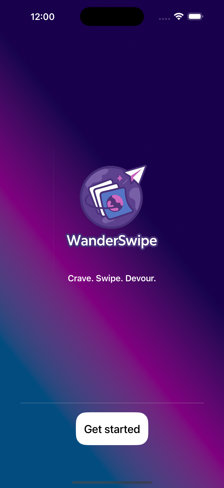
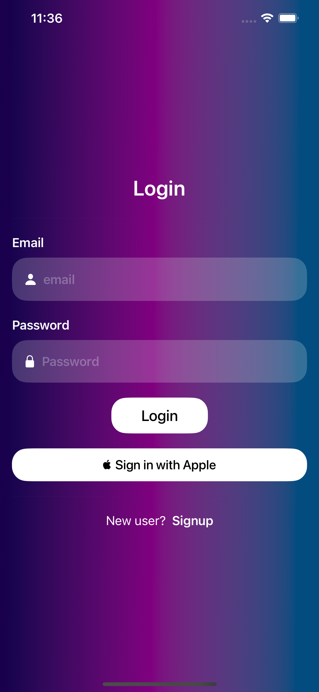
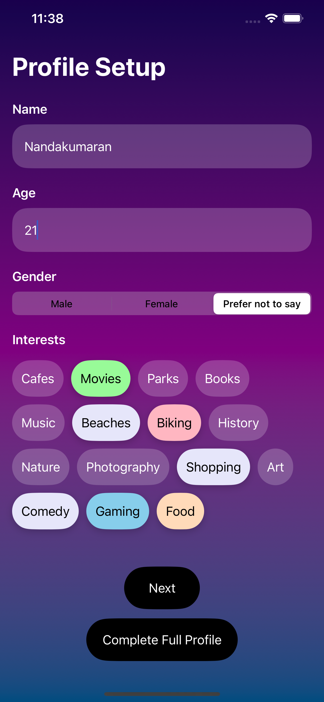
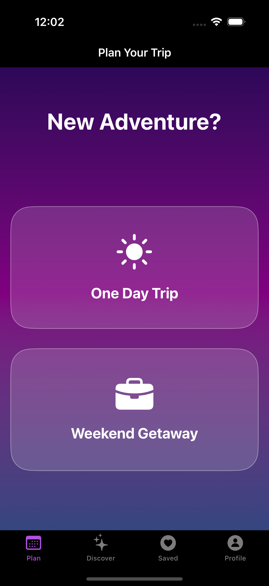
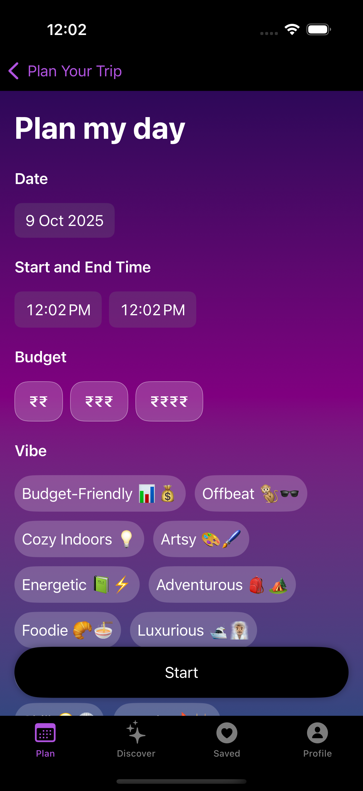
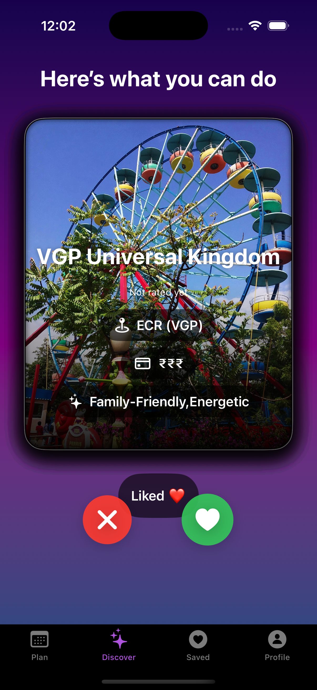
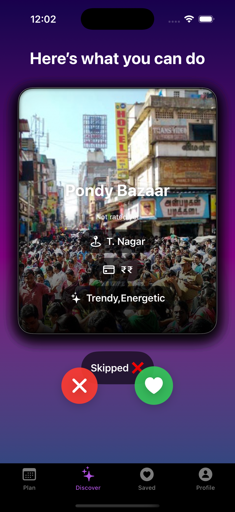
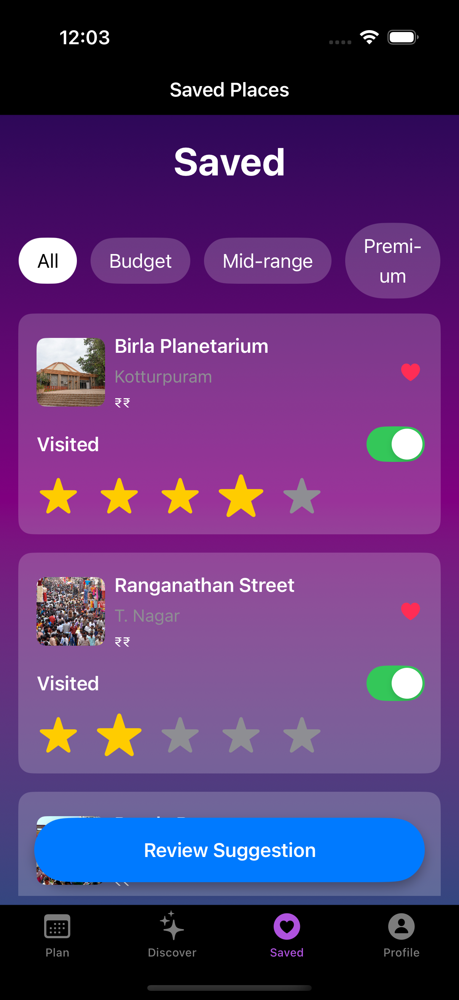
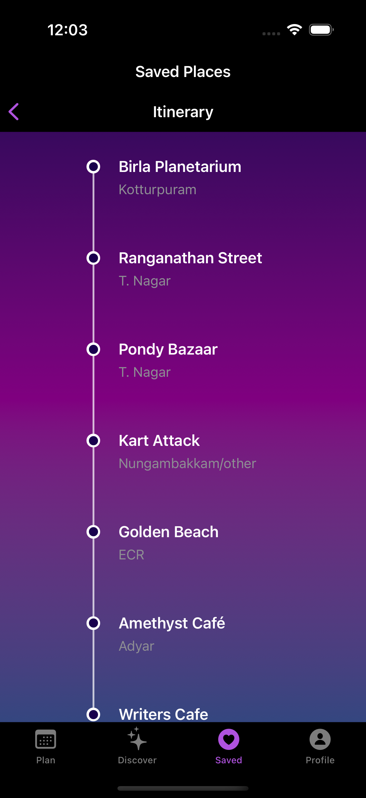
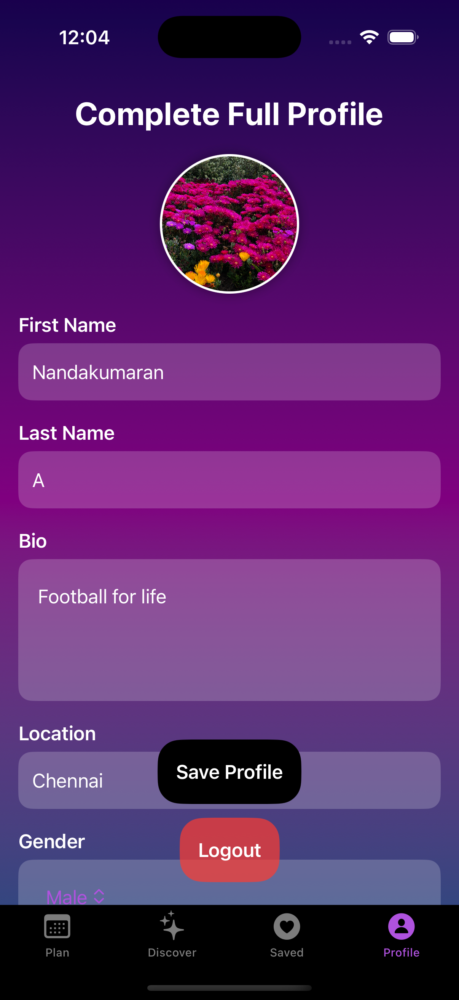

# WanderSwipe

WanderSwipe is a solo travel planner app designed to help users discover new destinations and plan their trips with ease. It features a fun, interactive interface for exploring places and automatically generates itineraries based on user preferences.

## Features

- **User Authentication:** Secure registration and login functionality.
- **Personalized Profile:** Set up your travel preferences for a tailored experience.
- **Swipe to Discover:** A Tinder-like interface to swipe through and discover new places.
- **Saved Places:** Keep a list of your favorite and most interesting destinations.
- **Automatic Itinerary:** Generate a day-by-day travel plan based on your saved places.

## Tech Stack

- **Frontend:** Swift, SwiftUI
- **Backend:** PHP, MySQL, Composer

## Getting Started

To get a local copy up and running, follow these simple steps.

### Prerequisites

- [Xcode](https://developer.apple.com/xcode/)
- A local web server environment (e.g., [XAMPP](https://www.apachefriends.org/index.html), [MAMP](https://www.mamp.info/en/mamp/))
- [Composer](https://getcomposer.org/)

### Backend Setup

1.  **Navigate to the backend directory:**
    ```sh
    cd wanderSwipe_backend/wanderSwipe
    ```
2.  **Install PHP dependencies:**
    ```sh
    composer install
    ```
3.  **Set up the database:**
    - Create a new MySQL database.
    - You will need to manually create the database tables based on the API files.
4.  **Configure the backend:**
    - Open `config/config.php` and update the database connection details (host, username, password, database name).
5.  **Start the server:**
    - Point your local web server to the `wanderSwipe_backend/wanderSwipe` directory.

### Frontend Setup

1.  **Navigate to the frontend directory:**
    ```sh
    cd wanderSwipe_final
    ```
2.  **Open the project in Xcode:**
    ```sh
    open wanderSwipe.xcodeproj
    ```
3.  **Configure the API endpoint:**
    - In Xcode, open the `APIHandler.swift` file.
    - Update the `baseURL` variable to point to your local backend server's URL (e.g., `http://localhost/wanderSwipe_backend/wanderSwipe/api`).
4.  **Run the app:**
    - Select an iOS Simulator and click the "Run" button in Xcode.

## Screenshots

| Get_Started | Login_Screen | Profile_Setup | Trip_Options | Plan | Right_Swipe | Left_Swipe | Saved_Places | Itinerary | Full_Profile |
| :---: | :---: | :---: | :---: | :---: | :---: | :---: | :---: | :---: | :---: |
|  |  |  |  |  |  |  |  |  |  |

## API Endpoints

The backend provides several API endpoints under the `/api` route, including:

- `/users/register.php`: User registration
- `/users/login.php`: User login
- `/user_profiles/user_profile.php`: User profile management
- `/main_swipe/fetch_places.php`: Fetch places for swiping
- `/record_swipe/record_swipe.php`: Record user swipes
- `/saved_places/get_all.php`: Get all saved places for a user
- `/plan_my_day/plan_my_day.php`: Generate a travel plan

## License

Distributed under the MIT License. See `LICENSE` for more information.
